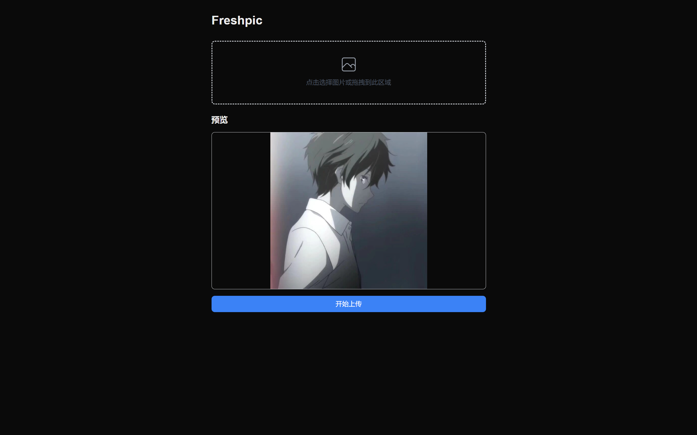
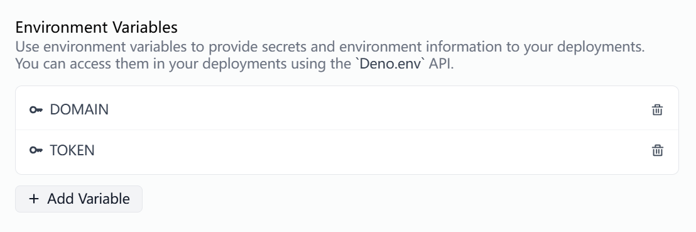

# Freshpic
基于Fresh,Deno-kv,Deno-deploy实现免费图床。

## 上传图片
```bash
curl -X POST https://your-domain.com/upload \
  -F "file=@/path/to/your-image.jpg"
```
## 响应
```json
{
  "url": "图片访问URL",
  "name": "原始文件名"
}
```
## Fresh project

Your new Fresh project is ready to go. You can follow the Fresh "Getting
Started" guide here: https://fresh.deno.dev/docs/getting-started

### Usage

Make sure to install Deno: https://deno.land/manual/getting_started/installation

Then start the project:

```
deno task start
```

This will watch the project directory and restart as necessary.

### Deploy

Make set DENO_DEPLOY_TOKEN in your environment

Then deploy project:

```
deno task build
deployctl deploy --project=your-project-name
```

And set environment eariables (DOMAIN and TOKEN) in your deno dash 


